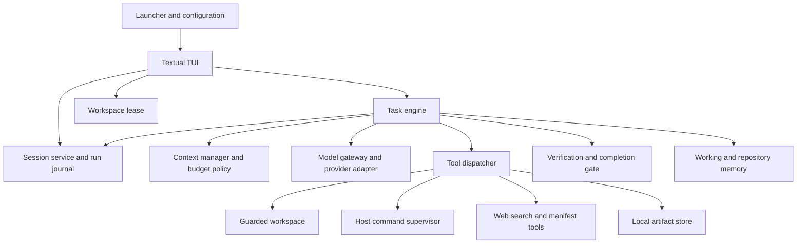

# Ion architecture

This document describes the working-tree implementation reviewed on 2026-09-27. It records current choices and their consequences; proposed capabilities appear separately under implementation limits. Operational setup is in [README.md](README.md).

## Runtime shape

Ion is a Python application with a foreground Textual UI and an asynchronous task controller. The controller owns tool execution, budgets, evidence, and completion. A model proposes actions through an OpenAI-compatible adapter.

| Area | Source and responsibility |
| --- | --- |
| Entry and configuration | [launcher.py](src/ion/launcher.py), [config.py](src/ion/config.py): terminal validation, fixed workspace, credential sources, profiles |
| Interface | [tui](src/ion/tui): task submission, steering, model selection, issue import, history, rendering |
| Controller | [engine.py](src/ion/engine.py): phases, model turns, recovery attempts, tool dispatch, final results |
| Contracts and protocols | [contracts.py](src/ion/contracts.py), [protocols.py](src/ion/protocols.py): immutable validated records and structured actions |
| Model access | [gateway.py](src/ion/gateway.py), [providers](src/ion/providers), [models](src/ion/models): adapter boundary, normalized events, catalog |
| Context and limits | [context.py](src/ion/context.py), [budget.py](src/ion/budget.py), [budget_policy.py](src/ion/budget_policy.py) |
| Local actions | [tools](src/ion/tools), [workspace.py](src/ion/workspace.py), [processes.py](src/ion/processes.py) |
| Evidence | [verification.py](src/ion/verification.py), [artifacts.py](src/ion/artifacts.py) |
| Persistence and ownership | [storage.py](src/ion/storage.py), [session.py](src/ion/session.py), [recovery.py](src/ion/recovery.py) |
| Memory | [working_memory.py](src/ion/working_memory.py), [memory](src/ion/memory) |

The optional `make install` target registers the checkout as an editable uv tool, exposing an `ion` command through the user tool executable directory. The launcher still captures the caller's working directory; configuration resolves from the Ion source checkout. Tool installation has its own dependency environment, while the hackathon Makefile launch continues to use the checkout's locked environment.

## Task lifecycle

1. The launcher captures the current directory and resolves configuration and credentials. The TUI constructs a validated `TaskSpec` for a submission.
2. The TUI acquires a workspace lease, captures the baseline, creates per-task artifacts and a command supervisor, and opens repository memory. It journals the task before running the engine.
3. The engine classifies intent, reads root repository instructions, and retrieves bounded memory. For a task naming one file, economy mode may prefetch source without a model request.
4. For each turn, the engine chooses tools and an output allowance, builds bounded context, reserves budget, and requests model output. Steering takes effect at turn boundaries.
5. The controller validates actions and dispatches permitted tools. It records operation intent before dispatch and completion afterward. Reads establish edit evidence; writes update attribution; commands retain output and may supply verification records.
6. Finalization captures changes, a patch artifact, the workspace fingerprint, usage, and limitations. The completion gate determines verification status. The TUI persists the result and releases resources and ownership when safe.

`Phase` defines intake, inspect, plan, act, verify, and finalize. These phases guide tool selection and UI events; the engine can revisit inspection or edits instead of following a one-way pipeline.

## Decisions and tradeoffs

### 1. Keep orchestration outside the model

The engine owns authority, budgets, and completion rather than accepting model claims as evidence. Frozen Pydantic contracts reject unknown fields. Provider adapters normalize text, tool calls, usage, completion, and errors into `ModelEvent` records. Structured JSON profiles use a strict action parser alongside native tool calling.

This boundary lets tests substitute the scripted provider and keeps provider details out of tools. Compatibility currently means the OpenAI chat protocol; another wire protocol requires an adapter. Direct DeepSeek requests explicitly disable thinking mode because the current tool history does not retain the reasoning fields that its thinking-mode API requires on subsequent turns.

### 2. Constrain evaluation to submitted provider profiles

Configuration names endpoints, models, credential variables, and limits. HTTPS validation rejects embedded credentials. The launcher never loads dotenv files. An exported `AI_API_KEY` activates evaluation; product users select a provider and enter its key through `/connect`, which retains it only in the current process. The current evaluation fallback is the direct DeepSeek profile. A misspelled `AI_APIA_KEY` produces a corrective startup error without exposing its value.

Normal TUI launches begin without an active model, even if a provider key is present. The user selects a profile through `/models` or connects a provider; until selection, the UI blocks tasks, issue imports, and diagnostics without making provider requests. The configured `default_profile` remains the evaluation fallback rather than a product-mode startup selection.

Evaluation locks profile definitions and permits interactive selection only from `evaluation_profiles`. The submitted allowlist contains DeepSeek Flash (initial selection) and Qwen Plus (DashScope Beijing). Both resolve credentials exclusively from `AI_API_KEY`. `/model` and the provider picker make no network requests and cannot switch profiles during a task. Configurations without multiple evaluation choices retain single-profile locking. Evaluation ignores `AI_PROVIDER`, `AI_BASE_URL`, and `AI_MODEL` overrides to preserve the submitted endpoint, model, and limits as required by [RULE.md](RULE.md). There is no automatic cross-provider fallback. This keeps routing explicit: the evaluator chooses the provider that issued the key, with no additional environment configuration or credential re-entry.

### 3. Use one writer and guarded filesystem mutations

Regular tasks keep the immutable launch directory as their workspace. A pasted GitHub issue URL or `/github` command first creates a fresh shallow checkout under `workspaces/`, then imports issue evidence and starts a task scoped to that checkout. The checkout path is shown in the TUI and persisted with the task. Clone progress is drained asynchronously into the TUI, with elapsed-time feedback and cancellation available before the model starts. Clone subprocesses do not inherit model credentials or Git credential helpers; cancellation or failure removes only the incomplete checkout. Successful checkouts and partial agent edits remain for inspection. The TUI retains the issue URL, checkout, and fetched evidence for short in-session follow-ups and retries. `/new` or a standalone regular task clears this reference; a context-free issue reference is rejected before provider requests. This does not restore a previous model conversation or infer issue context from unrelated run history. No GitHub write operation is part of this flow. `Workspace` rejects absolute paths, traversal, and symlink targets. It captures baseline hashes and records writes so final changes distinguish attributable edits from concurrent modifications.

`file_read` returns bounded pages and read IDs. `edit_file` replaces observed text using current evidence; `write_file` requires complete observed contents for existing files and refuses to overwrite a file through creation. The context manager and dispatcher also restrict write evidence to source visible in the active request. There is no file-deletion tool.

A workspace lease combines an OS lock with a durable claim. An interrupted owner can leave `recovery_required` state even after its process exits. This favors explicit reconciliation over admitting a writer when an earlier side effect is uncertain. Filesystem checks do not prevent arbitrary host programs from accessing other paths.

### 4. Offer small tool bundles without treating visibility as permission

[bundles.py](src/ion/tools/bundles.py) selects tools by phase, intent, available source evidence, artifacts, and command authority. Inspection offers listing, search, outlines, reads, symbol tracing, web search, and infrastructure scans. Edit phases offer guarded writes; verification offers diffs and permitted commands or linters. Artifact tools appear when evidence exists.

A supported tool omitted by a phase can be offered on a later turn if it remains eligible. Unknown or prohibited calls receive correction guidance; repeated unsuccessful corrections stop the task. Execution checks still apply. Recognized repository questions cannot acquire mutation or command authority through a model request.

This reduces schema overhead while allowing navigation after edits. `trace_symbol` uses syntax patterns, not compiler resolution. Infrastructure scans report declared configuration, not live deployment state. Linting chooses configured or installed tools and preserves diagnostics; it does not install a toolchain or prove task correctness.

### 5. Budget both input and useful output before dispatch

`BudgetLedger` reserves estimated input plus output cap before a request and settles against complete reported usage when available. Failed requests and retries consume budget. `BudgetPolicy` selects inspection, edit, rewrite, verification, or finalization allowances and protects capacity for the last two stages.

Economy mode is currently disabled in the committed configuration. When enabled, its configured limits allow 12 requests and 24,000 accounted tokens, with preferred output caps of 512/1,024/4,096/512/512 by work class and 256-token verification and finalization reserves. Model limits and remaining budget can reduce caps. Legacy runs use a 24-request ceiling. The ledger also enforces a ten-minute admission deadline.

Context estimates include serialized messages and schemas rather than a model-specific tokenizer. These controls limit admission; they cannot guarantee exact billing. A truncated output can receive one economy retry with a larger allowance, but partial tool calls are not executed.

### 6. Preserve required context and compact evidence as units

`ContextManager` pins the task, repository instructions, and applied steering, then fits memory, progress, and recent exchanges within the input allowance. It trims bulky tool bodies and removes older completed exchanges together to preserve call/result pairing. It records inclusion and omission decisions in a `ContextManifest`.

If required instructions or the latest necessary turn cannot fit, the controller reports context overflow rather than silently dropping them. Output-aware planning allows one configured compaction recovery. Loop guards and repeated-page tracking stop unproductive cycles; an edit task receives one bounded recovery turn after repeated unchanged reads, with the next native request directed to `edit_file`. Stale file references require rereading.

The instruction resolver supports ancestor instruction files for supplied paths, preferring `AGENTS.md` over `CLAUDE.md` in a directory. The engine currently invokes it with no paths, so automatic task intake loads root instructions only.

### 7. Separate working memory, reusable memory, and history

Working memory stores bounded file and artifact pointers in each task's artifact directory, including a generated `MEMORY.md`. Repository memory uses a separate SQLite database per workspace identity. Records carry scope, evidence kind, source references, hashes, lifecycle status, validity windows, and supersession metadata. Retrieval is bounded and local; future-dated records are withheld and the engine records file observations and successful command recipes.

Retrieved memory is evidence, not authority. Lifecycle helpers support invalidation and forgetting; forgetting excludes retrieval without erasing source artifacts. Memory persistence is advisory, so a local database failure does not discard the active tool result. Do not assume that stored facts establish current file contents: guarded edits still require current reads.

The run journal stores tasks, ordered events, operations, and deduplicated control requests. It does not restore a complete model conversation. Checkpoint contracts and the atomic `Compactor` exist and have tests, and context assembly accepts checkpoints, but the current engine does not invoke the compactor or pass a loaded checkpoint into its request loop.

### 8. Execute checks locally with bounded resources

`CommandSupervisor` runs host subprocesses in the workspace with a small environment allowlist, a timeout capped at 120 seconds, retained output capped at 16 MiB, and process-group cleanup. Dispatch policy checks commands and paths; known secrets are redacted from captured output. The supervisor uses shell execution, so these checks are not a security sandbox.

This supports existing project test commands without provisioning containers. The command policy rejects multiline input, shell chains, redirection, and command or process substitution before invoking the shell. It requires trusted repositories: tests, build scripts, and installed tools run with the user's host permissions. There is no container backend or hostile-code isolation guarantee.

### 9. Require evidence tied to the final workspace

Verification observers recognize relevant successful checks from supported test runners and attach the command operation and workspace fingerprint. The completion gate rejects ambiguous attribution and requires a passing record matching the final fingerprint for verified edits. Explicit read-only completion can use controller-generated static evidence when the workspace is unchanged. Unspecified tasks do not receive static completion credit for merely reading files, and an explicit blocker remains blocked. Edit requests using solve, resolve, or repair receive the same guarded edit tools as fix requests.

The result distinguishes verified, unverified, blocked, budget exhausted, failed, and cancelled outcomes. A patch, a model's summary, and a linter's success are insufficient by themselves. Relevance detection uses command and output heuristics, so a valid check can remain unrecognized and produce an unverified result.

### 10. Persist intent and evidence without replaying mutations

`RunStore` uses SQLite WAL with tables for runs, events, operations, and control-request deduplication. Tool intent precedes execution; an interrupted operation can remain unresolved. `/resume` checks those records and repopulates the composer for a new submission. It does not replay the operation or continue the old engine.

`SessionService` provides inspection, event subscription, results, and control records over an owner-only Unix socket. The TUI starts that service, but socket control records do not constitute a detached engine supervisor. The foreground UI still owns task lifetime.

Artifacts use atomic writes, hashes, and completeness metadata. Diagnostics retain bounded structured events separately from full task evidence. This makes failures inspectable at the cost of retaining sensitive repository content locally without encryption.

## Stored data

The root is `ION_DATA_DIR`, otherwise `$XDG_DATA_HOME/ion`, otherwise `~/.local/share/ion`.

| Path | Contents |
| --- | --- |
| `runs.sqlite3` | Task specifications, results, events, operation journal, request deduplication |
| `artifacts/<task_id>/` | Command output, patches, imported issue evidence, working-memory pointers |
| `workspaces/<owner>-<repo>-<issue>-<unique>/` | Retained GitHub issue checkouts and edits |
| `memory/<workspace_id>.sqlite3` | Source-linked repository memory |
| `ownership/<workspace_id>.json` and lock file | Durable writer claims and OS locking |
| `logs/ion.jsonl` | Rotating structured diagnostics |

The Unix socket uses a short data-root-derived path in the system temporary directory. Private file permissions reduce accidental exposure; neither permissions nor hashes defend against a hostile process with the same user authority.

## Implementation limits and extension points

- Foreground execution is implemented. Detached execution and restoration of a full durable model conversation are not wired into the product loop.
- Atomic checkpoint helpers exist, but runtime checkpoint creation and restoration remain integration work.
- [workers.py](src/ion/workers.py) and [snapshots.py](src/ion/snapshots.py) contain read-only delegation and snapshot primitives. Delegation defaults to disabled and is not an active multi-agent product workflow.
- GitHub import and web snippets are bounded, untrusted external evidence. Public issue import retains at most 100 comments and depends on service availability.
- [evals/runner.py](evals/runner.py) requires an executor; without one it reports `not_run`. Offline tests and a small live smoke script do not establish broad issue-solving reliability.
- Unix sockets, `fcntl` locks, and process-group signals make macOS/Linux the current execution target. There is no implemented Windows abstraction for these paths.

For a new tool, define its schema and dispatch behavior in the tool registry, decide phase eligibility in bundles, and test permission and evidence handling. For a provider, preserve normalized events and usage accounting. For persistence changes, retain operation-before-side-effect ordering and conservative recovery behavior.
