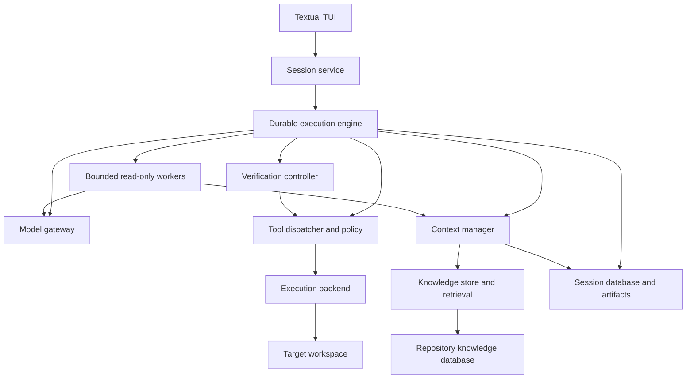

# System architecture

Status: proposed v1 architecture. No runtime is implemented in this documentation deliverable.

## Architectural decision

Build a modular Python application with a durable session engine and a TUI as its sole user-facing interface. Keep repository execution in supervised subprocesses. The primary agent owns edits; optional workers perform bounded read-only research or review.

Python 3.12 is the development compatibility target, with the exact patch release and dependencies locked during implementation after OPEN-02 validation. Use asyncio, SQLite/FTS5, filesystem artifacts, Textual, and uv packaging. Do not add a workflow server, hosted memory dependency, or mandatory container daemon to the competition baseline.

The agent loop is an explicit state machine owned by Ion. This gives direct control over tool settlement, provider message validity, and completion evidence. The cost is owning recovery tests and migrations ourselves. LangGraph remains a viable alternative, but adding it would not remove the need to reconcile repository side effects; see DEC-02 in [research-and-decisions](research-and-decisions.md).

## Component map

| Boundary | Owns | Must not own |
| --- | --- | --- |
| Session service | User commands, session discovery, reconnect, ordered event delivery | Agent reasoning or UI-specific task logic |
| Engine | State transitions, budget admission, durable intent/settlement, recovery | Provider-specific wire format |
| Model gateway | Credential, adapter capabilities, request/response normalization | Repository command execution |
| Context manager | Selection, token accounting, instruction provenance, compaction | Changing acceptance criteria or authorizing tools |
| Knowledge store | Source-linked facts, search, invalidation, forgetting | Authoritative task outcomes |
| Tool dispatcher | Validation, capabilities, concurrency, operation records | Trusting model text as execution evidence |
| Execution backend | Processes, filesystem primitives, termination, output collection | Model credentials |
| Verification controller | Check plan, evidence freshness, criterion status, final gate | Declaring correctness solely from an LLM review |
| Worker coordinator | Scope, read-only snapshots, child lifecycle, budget reservations | Recursive delegation or concurrent workspace writes |

## Process and storage topology

One engine process owns a session's event database and serves its restricted local socket. The TUI can disconnect without killing the engine. A re-launched TUI finds the session under Ion's private data root and reconnects. Engine exit releases the OS workspace lock but leaves a durable ownership claim. Every new or resumed session must reconcile that claim and its processes/unknown operations before obtaining write authority.

Repository commands run in separate process groups with sanitized environments. Workers have separate logical transcripts and bounded contexts; they do not inherit the parent's entire conversation or capability set. They can execute as engine-managed asynchronous jobs because their exposed tools are read-only and brokered by Ion.

Different sessions may inspect the same repository. Only one session may mutate a particular workspace at a time. External editor changes remain possible and are handled with content preconditions and invalidation, not an assumption that the advisory lock controls the user.

The session journal is the durable record of actions and observations. Task projections and reusable knowledge are different stores with different authority. A private workspace ownership registry coordinates admission across sessions; unresolved old claims block new writers. A corrupted optional knowledge index can be rebuilt or bypassed; a journal/ownership integrity failure stops further mutations.

All exact records and defaults are defined in [interfaces-and-data](interfaces-and-data.md).

## One task through the system

1. Input adapter supplies text and repository identity; engine validates profile, credentials, permissions, and budgets.
2. Intake captures the workspace baseline and requirement set. Repository instructions are discovered with provenance.
3. Context assembly combines pinned requirements, current task state, fresh repository evidence, and bounded knowledge retrieval.
4. Gateway obtains a complete model response; dispatcher validates requested tools and records operation intent.
5. Backend executes allowed operations. Results/artifacts are settled durably and task state is updated.
6. The model proposes further investigation, changes, or completion. Verification runs against the final workspace.
7. Controller publishes a final result with patch, evidence, usage, and limitations. No UI code can bypass this gate.

## Durable event rules

Events and their state projections commit together before the TUI receives durable notifications. Artifact references become visible only after the referenced file is finalized. Live text fragments are expendable; final messages and tool settlements are durable.

Database commits cannot make a filesystem patch or external command transactional. Prepared/running operations found after a crash are reconciled through preconditions, recorded process identity, workspace fingerprints, and output artifacts. Unknown outcomes are first-class states, not an invitation to rerun.

A checkpoint is a reference into the journal plus compacted context, not a replacement for the journal. See [task-lifecycle-and-verification](task-lifecycle-and-verification.md).

## Extension boundaries

ModelGateway isolates providers. ExecutionBackend exposes file/command operations and may later gain a container implementation. MemoryStore exposes scoped observe/query/forget operations; external services require explicit opt-in and cannot become required for evaluation. The TUI consumes the internal session contract. That contract is not a promise of a public HTTP, editor, or alternate-client API.

LSP and syntax indexing are optional retrieval adapters. MCP/custom tools, if later added, must register through the same schema, policy, budget, and evidence controls. An extension cannot widen its own permissions or change the locked evaluation model.

Container execution is a future backend, not a claim of present security. Local capability checks are application controls, not a sandbox. See [security](security.md).

## Failure containment

| Failure | Boundary and response |
| --- | --- |
| TUI disconnect | Engine continues; re-launched TUI reconstructs from snapshot/events. |
| Optional retrieval timeout | Log degraded retrieval and inspect repository directly. |
| Model transient error | Bounded gateway retry charged to task budget. |
| Provider context overflow | One safe compaction recovery before side effects; otherwise report failure. |
| Invalid tool call | Return structured validation feedback; execute nothing. |
| Command timeout | Terminate process group, retain bounded output, reconsider strategy. |
| Storage failure | Stop dispatching mutations; stop active side-effectful work where possible; reconcile after recovery. |
| Engine crash | Reacquire ownership, inspect pending operations, resume only known-safe work. |

## Delivery order

Implement the end-to-end coding loop through the TUI from the start; then durability/verification, memory/context, and measured workers. A polished interface does not substitute for externally verified issue resolution. Milestones and acceptance gates are in [implementation-plan](implementation-plan.md).
