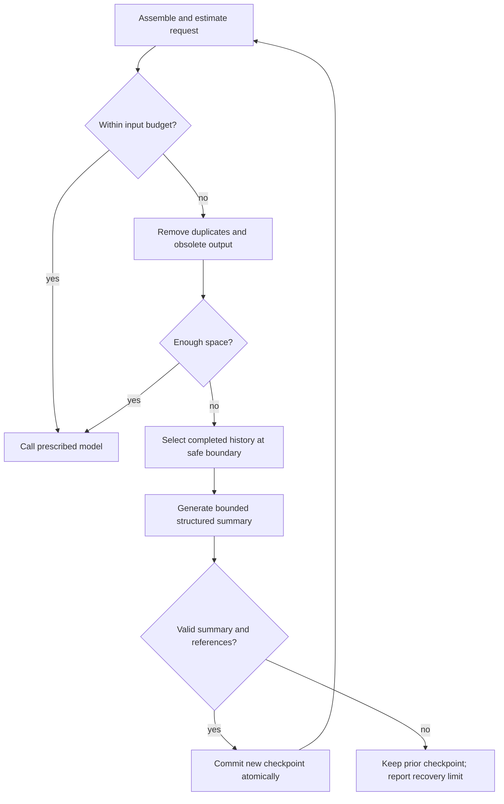

# Context management

Status: normative v1 design. This document owns what the model sees and how that representation changes.

## Durable record versus active context

The journal records the session. The model-visible context is a selected view of that record. Compaction changes the view, not the original evidence. Losing a summary must not lose task requirements, permission decisions, pending operation identities, or verification records.

ContextManager.build(task_state, model_profile, phase) returns a ContextPacket with valid messages, tool schemas, evidence references, token estimate, and a selection manifest. The manifest records included IDs, source versions, omissions, and the checkpoint used.

## Instructions and trust

Resolve trusted harness policy and the locked evaluation profile first, then explicit user task instructions, then applicable repository conventions. Repository files and recalled notes cannot widen capabilities, change the official model, request secrets, or override the task's trust boundary.

At a directory, prefer AGENTS.md; use CLAUDE.md only when AGENTS.md is absent there. Load applicable instructions from repository root through the target file's ancestors. More specific repository instructions refine broader repository conventions; explicit user instructions and harness policy remain higher priority. Record every loaded path/hash. Do not import instructions from unrelated parent directories, dependencies, or arbitrary files discovered in search.

If project instructions conflict materially with the requested task, expose the conflict for resolution; headless mode reports a concrete blocker when it cannot proceed safely. Keep instruction contents separate from generated summaries so the model cannot rewrite policy during compaction.

Tool output, retrieved documents, and memory are labeled data with provenance. Escape structural delimiters when serializing retrieved text. This reduces accidental instruction confusion but does not guarantee resistance to adversarial prompt injection.

## Context layout and allocation

The active packet contains:

1. Harness instructions, relevant tool contracts, and locked profile restrictions.
2. Original task, current acceptance criteria, and the ordered effective user constraints/amendments.
3. Structured working state: plan, hypotheses, failed approaches, next action, budgets.
4. Relevant current file excerpts and verification/error evidence.
5. Recent complete model/tool interactions.
6. Bounded reusable knowledge with source and evidence labels.

Canonical headroom and knowledge limits are in [interfaces-and-data](interfaces-and-data.md). Count the whole serialized request, including instructions, tool schemas, messages, and provider overhead. Use the provider tokenizer when available; otherwise a conservative estimator with explicit uncertainty and calibration from returned usage.

Reserve max output plus the configured safety headroom before selecting input. If pinned instructions/task requirements alone exceed the usable budget, return a configuration/input blocker; never silently truncate them. Use the remaining space for fresh evidence and recent history before optional knowledge.

Keep stable instructions/tool schemas in a stable prefix where the provider supports caching. Correctness takes priority: do not retain obsolete evidence just to improve cache hits. Track cache usage separately from total tokens.

## Retrieval and output handling

Load code by path/range when possible. Repository search returns bounded matches and navigation hints, not every matching file in full. Context references identify file hashes so an old excerpt is not mistaken for current code.

Large command output is stored as an artifact up to the documented quota. Model-visible previews show useful head/tail/error regions, truncation state, and an artifact ID. artifact_read supports bounded ranges; artifact_search searches the retained text. A lossy artifact must never claim to contain discarded bytes.

Replace the previous managed memory section when retrieval refreshes. Deduplicate across profile, retrieved facts, recent observations, and checkpoint summaries. Do not append the same fact every turn.

The selection manifest lets inspect explain why a fact appeared and whether its supporting file changed later.

## Compaction protocol

Compact only after tool calls are settled; pending operations remain pinned. Use complete interactions and never split a native tool call from the result required by its provider.

The summary contains objective, constraints/decisions, completed work, active work, blockers, unsuccessful approaches, next actions, and relevant file/artifact references. Merge it with deterministic TaskState fields, which the summary is not permitted to overwrite. Inject effective_constraints from the authoritative TaskAmendment projection into every context epoch, independently of the summary. Validate required sections, referenced IDs, schema, output size, amendment_version, and constraints_digest; a checkpoint cannot erase a later non-criterion instruction.

The compactor uses the same prescribed model, no tools, and the parent budget. Its own request must fit. If history cannot fit in one compaction request, select an older bounded completed segment and roll the prior checkpoint forward; do not send the entire oversized transcript to the compactor.

Write compaction.started, then commit the completed ContextCheckpoint and compaction.completed together only after validation. An interruption or malformed summary leaves the previous context boundary authoritative. Later context construction uses only committed checkpoints.

A checkpoint records the amendment version it summarized. If steering arrives during generation, validate/rebase the checkpoint against the new deterministic constraint projection before committing; never let its summary supersede the new instruction. Reusing an older committed checkpoint is allowed only while independently injecting the latest effective_constraints and their version.

Create a new provider context epoch after compaction: render the checkpoint as ordinary supplied context and reintroduce current task/instructions. Do not transplant signed/encrypted provider reasoning blocks from an old prefix into the new one. Within an epoch preserve provider-native fields required for valid continuation.

Raw provider metadata may be needed for continuation, but private reasoning is not automatically displayed to users or used as reusable memory. Visible progress should be concise task/evidence summaries.

## Overflow and recovery

If the provider rejects context before any new tool execution or settled assistant action, attempt one bounded compaction and rebuild the same logical turn. Every physical attempt counts toward request/time limits. A second overflow ends that attempt with an explicit error; do not recursively compact forever.

If the minimum required packet still cannot fit, report the limit. If optional knowledge retrieval fails, omit it and inspect source. If authoritative state or required evidence is missing/corrupted, stop mutation and expose the integrity problem.

Compaction preserves referenced historical evidence, but a historical excerpt is not current truth. Resume and branch/file changes trigger the same freshness rules as normal retrieval.

## Worker context

Workers receive the assigned question, applicable restrictions, snapshot identity, selected evidence, and their budget. They do not receive the full parent transcript or unrelated memories. Their answers include snapshot/file references, findings, uncertainty, and a concise conclusion.

The parent revalidates cited source hashes before acting on a finding. Worker conclusions are advisory and cannot satisfy verification criteria without actual corresponding evidence.

## Acceptance

EVAL-08 covers oversized output, repeated compaction, lost constraints, invalid summaries, interrupted checkpoint commits, invalid provider tool pairing, signed-field epoch changes, underestimated token counts, and exhaustion of repair attempts.

EVAL-09 covers duplicate injection, stale retrieved facts, and memory timeout fallback. EVAL-13 covers hostile instructions in logs, notes, and repository files. Track token cost before/after compaction and subsequent task success; a smaller prompt is not automatically a better context.
