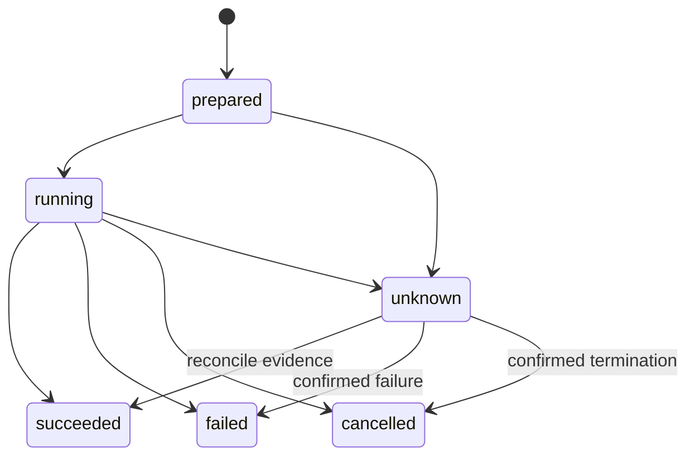

# Execution and tools

Status: runtime reference. Tool contracts are model-facing interfaces; their enforcement belongs to the harness.

## Tool registry

Expose a small, non-overlapping set. Descriptions explain intended use, bounded output, side effects, and common recoverable errors. JSON schemas are validated before any execution. Unknown tools/arguments and partial streamed calls execute nothing.

| Tool | Inputs | Output and side effects |
| --- | --- | --- |
| repo_list | relative_path, optional glob, cursor | Bounded file inventory, next_cursor; read-only. |
| repo_search | query, relative_paths, literal/regex, cursor | Bounded path/line/hash matches; read-only. |
| file_read | relative_path, start_line, line_count | Text excerpt and content hash; read-only. |
| patch_apply | edits containing path, expected_hash, exact patch | Changed paths/new hashes; workspace mutation. |
| command_start | command, cwd, timeout_seconds, background, optional readiness_probe | Operation/process handle, output artifact; arbitrary repository side effects. |
| command_poll | process_id, output_cursor | New bounded output, running/exited state, exit code/readiness; read-only control. |
| command_cancel | process_id | Termination acknowledgement and final settlement; process control. |
| diff_inspect | optional relative_paths | Delta from captured workspace baseline; read-only. |
| artifact_read | artifact_id, start_line, line_count | Bounded retained text and completeness indicator; no arbitrary host path. |
| artifact_search | artifact_id, query, cursor | Bounded matches within retained artifact. |
| task_update | plan changes, hypotheses, failures, next_action | Validated state version; cannot set verified outcome or invent observations. |
| memory_query | query, permitted scope | Source-linked, freshness-checked facts; optional retrieval. |
| memory_note | text, evidence_kind, source_refs | Candidate knowledge; validation prevents authority escalation. |
| delegate | goal, snapshot_id, purpose (research/review), request_budget | Child task handle and later cited findings; no recursive delegation. |
| finish_request | summary, criterion_evidence_ids | Request to enter verification/finalization, not an unconditional task exit. |

Inputs resolve beneath the selected repository or explicitly allowed managed artifact store. Reject traversal, symlink escape, and unsupported binary edits. Search honors declared ignore rules; report them so omitted paths are visible. Bounded read/search operations have cancellation and output limits even when read-only.

The tool set is filtered by role and execution policy. Workers receive only snapshot-bound listing/search/reading and assigned artifacts. They cannot use command_start, patch_apply, task_update on the parent, or delegate.

## Operation lifecycle

Admission checks validate schema, role, permissions, budget, deadline, workspace version, and concurrency. Commit prepared intent before dispatch. Record process identity or patch preconditions when running begins. Final settlement records typed status, artifacts, duration, and errors.

Exactly-once effects are not promised. If a process performs a write then crashes before settlement, its outcome is unknown until reconciled. A retry uses a new attempt ID tied to the logical operation; the old event remains visible.

## Editing and preservation

Capture the user's baseline before the first write: Git HEAD if present, index/worktree differences, relevant untracked files, file hashes, modes, symlink targets, and original content for every file Ion changes. No automatic stash, checkout, hard reset, commit, or cleanup of unrelated files.

patch_apply verifies every expected hash and hunk before applying any edit. For multiple files, stage replacements and a recovery manifest. Use atomic per-file renames where supported; the batch is not filesystem-atomic. A crash halfway through is reconciled from old/new hashes and the manifest.

If a file has changed externally, return stale_input and reread it. Do not fuzzily select a similar function or line. Unambiguous text normalization may be added only through an explicit tested future contract; v1 uses exact preconditions.

Maintain two separate artifacts: the observed baseline-to-final workspace delta, and changes attributable to Ion's recorded operations. The observed delta can include concurrent user edits and must never be labeled exclusively Ion-authored. Git HEAD alone is not the baseline when the user starts dirty. Preserve existing staged content and never stage changes automatically.

Record before/after contents and hashes for each Ion edit, and detect intervening external changes. Exclude unrelated externally edited files from the Ion patch. If an external change touches an Ion-edited file or occurs during an arbitrary writing command, mark ownership ambiguous unless provenance can establish the exact independent deltas. V1 does not guess or automatically rebase such changes: preserve the observed candidate, label patch_attribution=workspace_candidate, and block an Ion-attributed verified handoff pending explicit reconciliation. An unambiguous patch uses patch_attribution=ion; report any external changes present in its verification environment separately.

Automatic rollback is limited to Ion-owned writes whose current hashes still match the recorded post-write hashes. Otherwise preserve both versions as artifacts and report a conflict. Repository commands may alter arbitrary files; compare the workspace after each side-effectful command and do not claim guarded patch semantics for shell writes.

## Command supervision

The engine launches each command through a process-group supervisor wrapper. The wrapper cannot release the repository command until its generated handle, PID/start identity, working directory, deadline, and output artifact are durably recorded and the engine grants a start gate. If the engine dies before the gate, the wrapper exits without running the command. After the gate, it observes an engine-liveness pipe and terminates the command group on owner loss; recovery still checks surviving processes rather than assuming cleanup succeeded. Never trust a recycled PID when resuming.

Before any session dispatches a writing command, workspace-wide recovery admission must clear previous ownership claims. An orphan command from session A blocks session B as well as A's resume. A clean owner claim is recorded only after confirmed process termination and operation reconciliation.

Use an allowlisted inherited environment plus required nonsecret toolchain variables. Remove AI_API_KEY and known provider/cloud credentials. Close stdin by default; do not pipe automatic yes responses into unknown commands.

Foreground calls wait only until completion or their deadline. Long-running services use background=true and return a handle. Readiness probes are explicit process/exit checks or local HTTP/TCP probes with bounded time; an arbitrary matching log line is only a hint. Verify that the service did not exit immediately after its readiness signal.

Poll results return only new retained output by cursor. Unknown process handles return validation errors. On timeout/cancel, terminate the process group using the canonical grace interval, then settle the operation and capture exit status.

Drain output continuously to avoid deadlock. Apply preview, per-process artifact, and session quotas from [interfaces-and-data](interfaces-and-data.md). At the process cap, continue draining and count discarded bytes; mark the output lossy. If essential verification evidence is lost, rerun a narrower check if allowed or report it unavailable.

Pause stops new work, cancels in-flight model calls, and terminates command groups/workers; it does not leave hidden daemons running. Interrupted mutations remain unknown until reconciliation. UI disconnect alone does not pause a task. Finalization/cancellation always cleans up task-owned background processes.

## Concurrency and workers

Independent reads may run concurrently. Workspace mutations, tests, and commands that can write caches/files are serialized in v1. A declared background service may coexist with a test that needs it; its side effects remain subject to the verification fingerprint and cleanup checks.

Workers inspect a source snapshot: inventory plus immutable copies of eligible text files and explicit artifacts, captured within quota. Omit ignored/generated/private files and report omissions. If a snapshot cannot be captured within budget, skip delegation and inspect directly; do not substitute unsignaled live files.

Child results contain goal, snapshot_id, findings, source references, uncertainty, and usage. The parent checks supporting hashes before applying advice. Reuse an existing child only through its recorded task ID and assignment; no recursive child creation.

Budgets are reserved before child requests are dispatched so parallel workers cannot oversubscribe the parent. Reclaim unused allocation on settlement. Workers cannot select another model or authorize themselves.

## Recovery and loop detection

Tool validation failures are returned as structured feedback; repeated invalid calls consume the same recovery budget as other non-progress. Retry a transient provider request only if no tool side effect from it has begun, or if resumption can reconcile the exact recorded calls safely.

Detect non-progress using normalized tool name/arguments, relevant workspace hashes, result/error signature, and phase. Three equivalent settlements trigger a strategy revision. Legitimate command polling, new output, an explicit retry interval, or changed files prevents a false loop classification.

After the configured number of interventions, finalize with failed, blocked, or budget_exhausted as appropriate. A warning prompt alone is not recovery: require a new hypothesis, new evidence source, reduced reproduction, or changed check.

## Execution backends

ExecutionBackend provides list/search/read/apply_patch/start/poll/cancel/snapshot primitives. LocalProcessBackend is v1 and assumes trusted code. ContainerBackend is deferred: the same operations cross a container boundary, with credential-free task environments, scoped mounts, limits, and explicit network policy.

Dependency provisioning and restricted execution are distinct phases. A network-disabled task cannot fetch dependencies that were never provisioned. Never silently fall back from a requested isolated backend to local execution.

Acceptance is owned by EVAL-05–07, EVAL-11–13 in [evaluation](evaluation.md).
