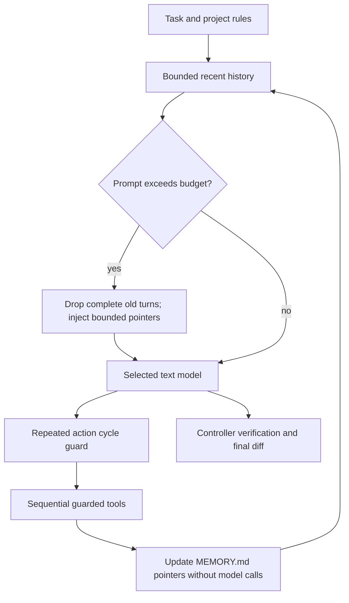

# Low-token architecture alignment

Source: `ai_harness_hackathon_prd_final.pdf`, September 26, 2026, supplied by the user. This note maps the PDF to the implemented low-token path. It does not claim that the entire PDF architecture is delivered.

## Implemented flow

## Mapping to the PDF

| PDF section | Ion implementation |
| --- | --- |
| §4.1, pages 4–5: model → tools → compactor → verification | Existing async engine follows this loop. Tool results settle before context is rebuilt. Tool-call/result pairs stay together during trimming. |
| §5.1, page 5: ephemeral context | Original task, effective steering, project rules and recent complete tool turns. Estimated input budget defaults to 6,000 tokens, including schemas. |
| §5.1: disk pointer memory | Controller-generated `MEMORY.md` in the run artifact directory, outside the target repository. Up to 12 entries, rendered within 1,800 characters. Contains file references, observed hashes, read offsets, patch status and last command artifact/exit status. No source bodies, stdout, command strings or credential values. |
| §5.1: project rules | Root `AGENTS.md`, or `CLAUDE.md` when no root `AGENTS.md` exists, is pinned independently of history and memory. Nested rule discovery remains future work. |
| §6.1, page 6: bounded output | File/artifact reads have 4,000-character pages. Large command/diff feedback keeps its head and tail, with explicit truncation. Command output remains available through its artifact ID. Search returns at most 20 short matches; listings return at most 60 paths. |
| §6.5: repeated sequence detection | Detects one-, two- and three-turn tool-call cycles with unchanged workspace fingerprint. Warns on the third repetition, skips that repeated batch, and stops on the fourth. Changed workspace resets detection. |
| §2: Makefile and runtime credential | Existing setup/run/test/clean targets. Locked evaluation uses only external `AI_API_KEY`; development retains user-requested provider profiles and local dotenv support. |

Memory is a navigation hint, never evidence of correctness or a source of instructions. File hashes are rechecked when pointers are rendered; stale entries require fresh reads. Pointer context is injected only after compaction, so short tasks do not pay for duplicate metadata. Optional pointers are omitted if needed to preserve the latest tool evidence. Required task/rule context is never silently truncated.

The memory file is written atomically with private permissions. It is an inspectable per-run snapshot, not automatic cross-session recall or crash recovery. Generation and maintenance use no model calls.

## Broader PDF work still required

The low-token changes retain Ion's existing explicit async state machine. LangGraph migration does not by itself lower inference-token usage. The PDF's Docker/worktree isolation, daemon lifecycle, independent general-purpose test validator and isolated research subagents require separate implementation and evaluation. They are not present in this change.

Subagents stay disabled for the small-bug baseline: they may reduce the parent's context while increasing total requests/tokens. Before enabling them, measure total parent-plus-child usage and task success, and require read-only scope and bounded result summaries.

Several PDF details need adaptation before implementation:

- Keep inference credentials in the host gateway, out of repository tool processes. Page 6 passes the credential into a network-disabled sandbox; repository commands do not need that credential, and the gateway needs network access.
- Retain hash-checked exact patches. Fuzzy writes need ambiguity checks and explicit safeguards before they can replace exact matching.
- Use closed stdin and bounded command timeouts. Do not blindly prepend `yes |` to installation commands.
- Preserve a distinct locked committee profile. Development's free OpenRouter model is not an official model selection.

## Evidence

The regression suite covers bounded context including schemas; preservation of the latest complete tool pair and project rules; pointer survival after compaction; stale file invalidation; absence of raw source from pointer memory; repeated single-action and multi-action cycles; reset on workspace change; and an engine run that stops a repeated read loop after four model requests while executing only two reads.

Validation on September 27, 2026: `make test` passed 27 tests. The earlier live small-bug TUI run passed three fixture tests; this memory/loop change was validated offline without consuming further free-provider quota. Character-based estimates are not exact tokenizer counts, and no measured live token reduction is claimed for this change.
