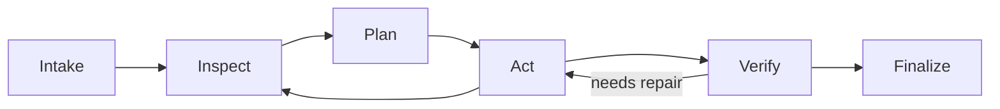

# Task lifecycle, recovery, and verification

Status: normative v1 design. Shared enums and records are defined in [interfaces-and-data](interfaces-and-data.md).

## State and phase

Execution status describes whether work can run; phase describes what the engine is doing. Outcome exists only when finished. Keeping them separate avoids treating a paused or waiting task as a completed one.

Small tasks may have one plan item. Larger tasks use a dependency-aware list; reject dependency cycles and do not mark an item done merely because its tool call returned.

Intake records task text, repository baseline, effective configuration digest, deadline, criteria, instruction sources, and initial environment. Discover available checks from repository documentation/manifests/CI configuration; these are evidence about how to test, not permission to execute untrusted code outside the chosen policy.

## Acceptance criteria

Preserve the original user/organizer criteria. Agent-generated criteria may clarify measurable behavior, but cannot silently weaken or delete original requirements. Every user steering message is a durable TaskAmendment, including constraints that are not criteria, such as “do not change dependencies.” Preserve its original text, source event, order, and explicit supersession links. The controller projects effective_constraints and amendment_version; the model cannot delete them through task_update.

Each required criterion identifies a verification kind: executable check, reproducible behavior observation, or cited static inspection. VerificationEvidence is tagged executable, observation, or static with the corresponding source/operation/hash requirements in interfaces-and-data. Only executable evidence always requires command_operation_id; static inspection must not fabricate a command. Code-changing tasks require relevant executable verification when available. A model review is advisory and does not substitute for a test that can run.

Criterion states are pending, satisfied, unsatisfied, or unavailable. Satisfaction is assigned by the verification controller from referenced observations. The model may propose evidence IDs; nonexistent, stale, out-of-scope, or irrelevant references are rejected.

## Tool-state and task-state ownership

task_update controls the plan and explicit hypotheses. It cannot create ToolResult/VerificationRecord objects, set operation exit codes, or force a final outcome. Tool settlements are written by the dispatcher; verification records by the verification controller; final outcomes by the engine.

A normal model stop or finish_request transitions into verification. It does not end the task successfully. Budget or cancellation checks can interrupt any phase, with deterministic cleanup/final reporting after the model budget has ended.

## Baseline and workspace fingerprint

Record pre-existing failures where practical before editing. Distinguish baseline failures from regressions; inability to obtain a baseline remains a reported limitation.

The workspace fingerprint covers tracked files, relevant untracked files, all files touched by Ion or its commands, test/configuration manifests, file modes, and symlink targets. Record exclusions such as generated caches explicitly. Relevant ignored source/config files cannot be excluded merely because Git ignores them.

Use content hashes, not mtime or HEAD alone. Include runtime versions, dependency/lockfile state, selected command, and relevant nonsecret environment in the environment fingerprint. Recompute before and after verification; a material change during a check invalidates it.

V1 conservatively invalidates prior verification on any subsequent source/test/configuration change in the fingerprint. More precise dependency-based reuse is deferred. Build outputs may be excluded only when they cannot influence the intended check without being rebuilt.

External writers cannot be fully locked out in local mode. Detect observed changes and reverify; report this concurrency limitation rather than claiming a transactional filesystem snapshot.

## Verification sequence

1. Derive a check plan from criteria, changed files, repository conventions, and available environment.
2. Reproduce the defect or run focused baseline checks when practical.
3. After edits, run focused regression tests, then relevant existing checks and broader checks if budget permits.
4. Inspect the complete observed workspace delta and the separately attributable Ion patch for unrelated edits, external/ambiguous changes, weakened tests, changed instructions, and accidental artifacts.
5. Stop task-owned services, recompute the workspace fingerprint, and invalidate any checks affected by final changes.
6. Map each required criterion to fresh evidence and decide the final outcome.

Report exact commands, exit status, artifacts, baseline comparison, scope, and missing coverage. If a test command exits successfully without collecting relevant tests, that is not satisfactory evidence. Validate collected tests or behavior outputs when the framework exposes them.

Tests written or modified by the agent are disclosed. The independent evaluation runner keeps its own expected outcomes and held-out tests outside the agent's allowed workspace. Neither a green self-authored test nor an LLM critique alone establishes benchmark resolution.

## Outcome gate

| Outcome | Condition |
| --- | --- |
| verified | Every required criterion has sufficient current evidence, no known unresolved relevant regression or patch-attribution ambiguity exists, and final changes match the verified fingerprint. |
| unverified | A candidate result exists, no known failure is being hidden, but one or more required checks are unavailable or evidence is insufficient. |
| blocked | A missing dependency, permission, input, or unreconciled operation prevents meaningful authorized progress. |
| budget_exhausted | A hard time/request/token limit prevents completion; preserve current patch and evidence. |
| failed | A terminal engine/provider error or unresolved required failure remains after bounded recovery. |
| cancelled | Explicit user cancellation completed cleanup; preserve partial work. |

No changes may be a valid result if evidence shows the requested behavior already holds; explain why patch_artifact_id is null. A code-change request must not be declared satisfied merely because the model produced an explanatory answer.

Evaluation measures actual resolution independently of these self-reported outcomes. The final report states verified scope and limitations rather than promising global correctness.

## Pause, steer, resume, and cancel

Steering is queued durably and applied at a safe operation boundary. If it changes the goal, record the amendment and replan; do not discard already completed work without evidence.

Pause rejects new dispatch, cancels pending model requests, terminates owned command groups/workers, and persists a resumable state. Budget wall-clock time continues under the development policy. Waiting for user input also counts; evaluation should not depend on interactive decisions.

Resume acquires the workspace lock, checks the durable ownership registry across sessions, validates schema/profile compatibility, rechecks files/instructions, reconciles pending operations, invalidates stale knowledge/checks, and rebuilds context including all effective amendments. New sessions perform the same workspace ownership admission before writing. A finished verified/failed task is inspected, not resumed as if unfinished; new work creates a new task. Blocked/unverified/budget-exhausted tasks may continue only through an explicit new task linked to the previous result, preserving its final outcome and applying the current profile.

Cancellation stops children/process groups and records the cancelled outcome once cleanup settles. If storage is unavailable, preserve recoverable files and report the failure on stderr; do not falsely claim a durable cancellation event was saved.

## Crash reconciliation

| Observation on restart | Required action |
| --- | --- |
| New session finds an old active/recovery-required ownership claim | Reconcile the old journal and all surviving command groups before granting any new write authority. |
| Tool prepared, no dispatch evidence | Check workspace/process evidence; redispatch only if non-execution is established or operation is safe/idempotent. |
| Patch manifest contains only old hashes | Record no applied changes; a fresh guarded attempt is permitted. |
| Patch manifest contains only new hashes | Record confirmed success without reapplying. |
| Mixed old/new hashes | Complete or reverse only matching Ion-owned writes through the manifest; unexpected hashes block automatic reconciliation. |
| Process still alive with matching identity | Reattach retained logs if supported; otherwise terminate and inspect effects before continuing. |
| Process absent, no terminal record | Mark unknown and inspect artifacts/workspace; absence is not proof of failure. |
| Completed compaction missing | Keep the last committed checkpoint and durable task state. |
| Artifact missing/corrupt | Mark affected evidence unavailable; do not reconstruct a success from an uncited summary. |

An operation that remains unknown blocks conflicting work across sessions, even if the original engine's OS lock has been released. Mark ownership clean only after confirmed cleanup and settlement. Do not promise exactly-once execution or use a generic retry decorator around repository mutations.

## Budgets and progress

Admission checks are atomic across primary and worker requests. Count physical model attempts, including compaction/extraction/retries, and record usage returned by the provider. Unknown usage is marked unknown; do not report a fabricated zero cost.

Reserve capacity for verification/reporting. Once the reserve begins, forbid optional research/delegation, focus on the best current candidate, and stop new speculative edits. Hard limits cannot be exceeded to obtain a nicer final answer.

Persist start/deadline timestamps for crash recovery and use a monotonic clock within a running process. On restart, use the persisted deadline; detect clock anomalies conservatively and report them rather than granting a fresh full budget.

Detect progress from new evidence, changed source, resolved failures, and criterion transitions. Repeated-call detection and strategy interventions are specified in [execution-and-tools](execution-and-tools.md).

## Acceptance

EVAL-07 validates recovery around every mutation/checkpoint boundary. EVAL-10 attempts to force false success using invented evidence, unrelated tests, zero-test runs, post-test edits, and missing artifacts. EVAL-11 verifies budget admission, pause/cancel, and worker containment. See [evaluation](evaluation.md).
